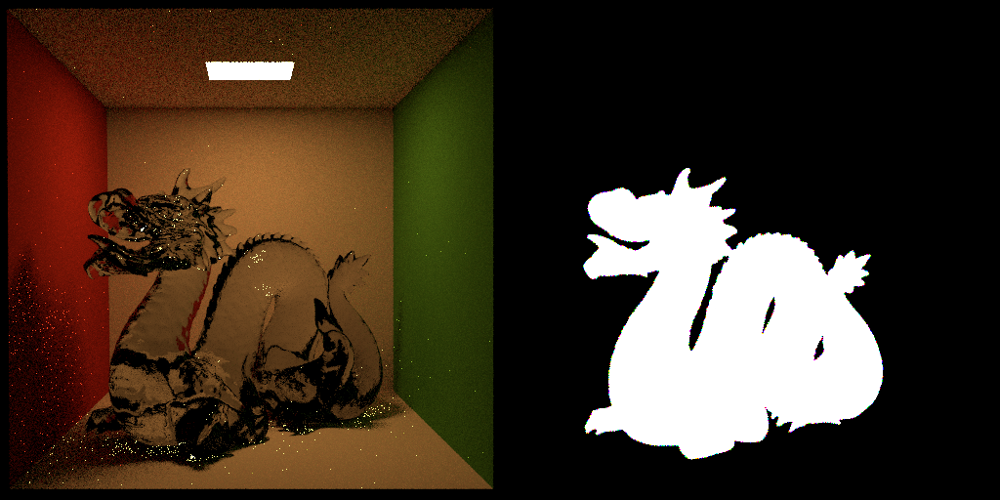

# Differentiable Rendering Optimization
This repository was initially made to experiment some optimization techniques for differentiable rendering. One of the optimizations is tested and proven to be effective, therefore we reorganized the repo to only include its implementation and the needed code to test it. 

The differentiable rendering implementation that we chose as our study case is that of **Mitsuba 2**, and even though our work is built on top of this renderer, the technique that we’ll present can be applied to any differentiable renderer that follows the same priniciples.

# Tools
## Mitsuba 2:
Mitsuba 2 is a research-oriented rendering system written in portable C++17. We chose Mitsuba 2 as our framework for this project because of multiple reasons:
* It’s open source and it’s  highly flexible.
* One of Mitsuba 2 key features is differentiable rendering.
* It provides extremely fine-grained Python bindings to almost every function in its system.
* Mitsuba 2 is well documented, both for the C++ code and its Python API.

## How to setup Mitsuba2?
1. Clone the project
2. Install [Miniconda 3](https://docs.conda.io/en/latest/miniconda.html)
3. Instal [Cuda 10.2](https://developer.nvidia.com/cuda-downloads)
4. Add **path/where/you/cloned/the/repo/tools/mitsuba2/dist** to the the PATH environment variable.
5. Add **path/where/you/cloned/the/repo/tools/mitsuba2/dist/python** to the the PYTHONPATH environment variable.

**NB :** Make sure to install the Python extension for VS Code, and choose the Minoconda's Python as your interpreter of choice.

# The Optimization
Analysing the optimization loop used in Mitsuba2’s differential rendering algorithm, we can see that the used loss function is a Mean Squared Error(MSE) calculated for all the pixels in the image. This means that all the pixels contribute uniformly to the final output of the function. However, each parameter can affect a local domain of the image, and does not necessarily affect the entire image.

What we propose is changing the loss function in a way that it ignores pixels that are unaffected by the differentiated parameter.
We achieve this by using masks; grayscale images that store in each pixel a normalized weight. Integrating these weights in the MSE function allows it to output more accurate values.

On top is the Mean Squared Error (MSE) used in the existing implementation on Mitsuba2, and the second function is our modifed version of the MSE. We multiply the squared error by the weight from the mask. To normalize, instead of dividing by the number of pixels in the image, we divide by the sum of all weights.

## Binary Mask
A binary mask, as the name says, stores binary weights, either a one or zero. It allows us to associate each parameter with the parts of the image that it’s correlated with. For example, the parameters of the BSDF attached to the Dragon object in the scene below, are associated with a mask that includes the dragon and excludes everything else in the scene.

*NB: Read the comments in the mask_integrator.py script to understand how we generate this type of masks* 

## Distance Map
A distance map includes all the pixels in an image but each pixel stores a normalized distance to the object. The main interest for this data is point emitters. They don't cover any surface in the rendered image, so their binary mask is all black. Since they emit light, their parameters also affect other objects in the scene indirectly, so the closer an object to an emitter, the higher their correlation.
Here's an example of the distance map of the light in the ceiling, note that this light is an area light, but we're using its center to demonstrate the distance map.

*NB: Read the comments in the distance_integrator.py script to understand how we generate this type of masks* 

# Benchmarks
**1. Reflecance of a BSDF affected to a small object in the scene**

Using MSE with masks minimizes the error much faster than the normal MSE that includes all the pixels.

**2. Reflecance of a BSDF affected to a big object in the scene**

The two methods perform almost exactly in the same way, and that's because the binary mask associated with parameter we're differentiating includes most of the image.

**3. Reflecance of a BSDF affected to a big object in the scene**

Not only the MSE with mask minimizes the error faster, but it also allows for convergence in less than 100 iterations.

*NB: These results are dependent on the scene and parameters that we choose, it doesn't mean that our method will perform always in this way with emitters and BSDFs*
